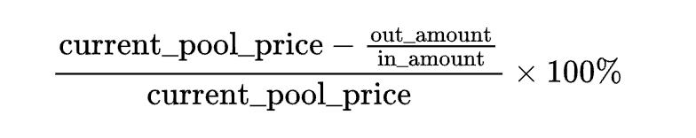

# Relevant mathematical methods

## 1. Calculate the amount of position coin_a and coin_b

use `/src/math/clmm.ts ClmmPoolUtil.getCoinAmountFromLiquidity()`

```ts
const pool = await sdk.Pool.getPool(poolAddress)

const liquidity = new BN(position.liquidity)
const curSqrtPrice = new BN(pool.current_sqrt_price)

const lowerPrice = TickMath.tickIndexToPrice(position.tick_lower_index)
const upperPrice = TickMath.tickIndexToPrice(position.tick_upper_index)

const amounts = ClmmClmmPoolUtil.getCoinAmountFromLiquidity(
  liquidity,
  curSqrtPrice,
  lowerPrice,
  upperPrice,
  false
)

const {coinA, coinB} = amounts
```

## 2. Calculate price from sqrt price

use `/src/math/tick.ts TickMath.sqrtPriceX64ToPrice()`

```ts
const pool = await sdk.Pool.getPool(poolAddress)
const price = TickMath.sqrtPriceX64ToPrice(new BN(pool.current_sqrt_price))
```

## 3. Calculate tick index from price

when you want to open position, you dont know how to set your tick_lower and tick_upper.

use `/src/math/tick.ts TickMath.priceToTickIndex()`

```ts
// decimalsA and decimalsB means the decimal of coinA and coinB
const tick_lower = TickMath.priceToTickIndex(price, decimalsA, decimalsB)
```

## 4. Calculate price impact in once swap trade

There are no existed function to get price impact, please use the subsequent mathematical formula for the calculation.



## 5. Transform type I32 to type number

There are some param is `I32` type, you can transform it by `asInN`. eg: tick.liquidityNet

```ts
const liquidityNet: new BN(BigInt.asIntN(128, BigInt(BigInt(tick.liquidityNet.toString()))).toString()),
```

## 6. Calculate swap fee and price impact

All the parameters come from the calculation results of the `sdk.Router.price(ETH, USDT, amount, byAmountIn, 0.05, '')`.

```ts
    const res = await sdk.Swap.calculateSwapFeeAndImpact({
      from_type: "0x26b3bc67befc214058ca78ea9a2690298d731a2d4309485ec3d40198063c4abc::usdt::USDT",
      from_amount : '1000000',
      to_amount: '31034210',
      pool_address:"0x8c30b4c434b8acc740e452311147790b67004a3e37387703afe5aa5c9c6a5e3a",
      router: {
        pool_address:"0xd1abb32c3ceeebb47b965d6b15790a780268ed69b95199cec3f7edc5b071dd4c",
        raw_amount_limit: '31071079541'
      }
    })
    console.log('res: ', res)
```
